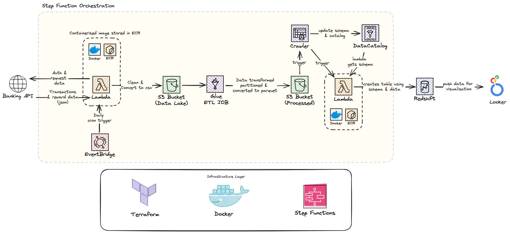
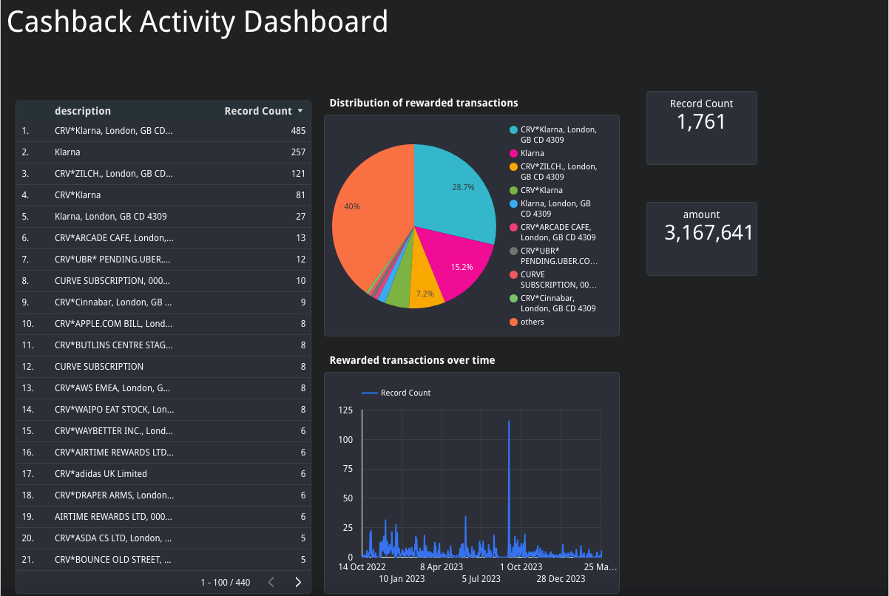
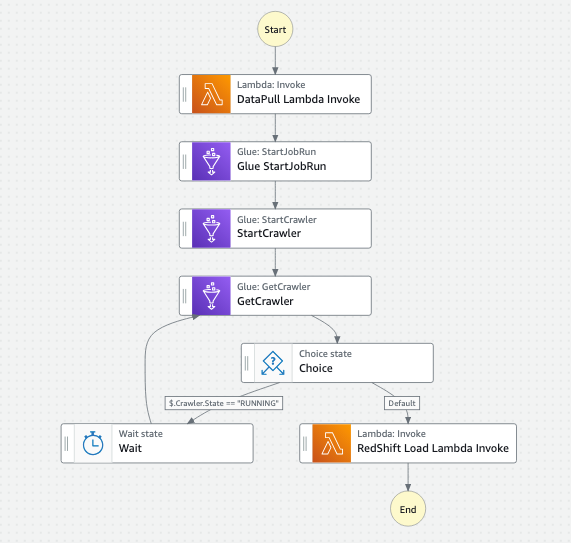
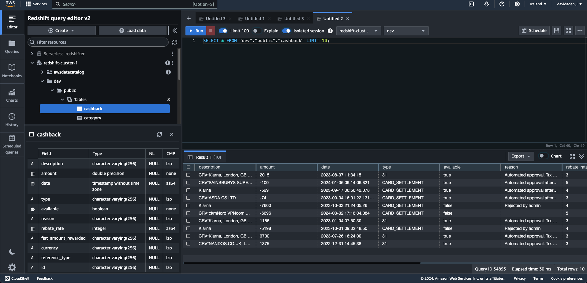

# Credit Card Rewards Pipeline

### Introduction

Credit card issuers frequently offer cashback incentives as a key selling point for their products. This initiative aims to create a streamlined and dependable data infrastructure for examining information related to credit card cashback rewards. The system is designed to gather, refine, and archive data obtained from payment cards through an API interface. Its primary objective is to uncover trends in spending habits and reward accumulation, providing valuable insights for both cardholders and issuers alike.

## Table of Contents

- [Architecture](#architecture)
- [Project Description](#project-description)
- [Dashboard](#dashboard)
- [Architecture Overview](#architecture-overview)
  - [Workflow Orchestration](#workflow-orchestration)
  - [Cloud Platform](#cloud-platform)
  - [Data Ingestion](#data-ingestion)
- [Technology](#technology)
  - [Infrastructure layer](#infrastructure-layer)
  - [Stack](#stack)
  - [Data Warehouse (Redshift)](#data-warehouse)
  - [Data Transformation (Glue/Pandas)](#data-transformation)
  - [Stack](#stack)
- [Setup](#setup)
  - [Pre-requisites](#pre-requisites)
  - [Instructions](#instructions)
  - [Tear Down](#tear-down)

## Architecture

The data pipeline consists of the following components:
1. Extract data using Open Banking API
2. Load JSON into AWS S3
3. Transform using glue and lambda
4. Copy into AWS Redshift
5. Visualise data using Google Data Studio Dashboard

Orchestrate with Glue and Docker
Create AWS resources with Terraform

### Project Description

Here's a rephrased version:

This project tackles the challenge of effectively monitoring and evaluating cashback rewards. Presently, cashback card users struggle to keep tabs on their reward status, often resulting in a lack of clarity about their financial perks. The absence of a streamlined tracking system hinders users from maximizing their spending strategies and fully capitalizing on the card's advantages.

To address this issue, the project proposes creating a specialized data pipeline that automates the gathering, processing, and storage of transaction and reward information via the card's API. This system will provide users with up-to-the-minute insights into their expenditures and reward status.

The automated data pipeline is designed to:

1. Compile comprehensive transaction data, offering a thorough overview of spending habits.
2. Track the accumulation and distribution of cashback rewards, ensuring users have access to current information.
3. Examine spending trends in relation to reward accrual, providing strategies to maximize cashback potential.
4. Deliver an intuitive, user-friendly interface for tracking and analysis, equipping users with practical financial insights.
5. Utilize serverless architecture to ensure scalability and cost-effectiveness.

By implementing this solution, users will gain a powerful tool to better understand and optimize their cashback rewards, ultimately enhancing their financial decision-making and benefits from the card.

Examples of data can be found at `rewards.csv` and `transactions.csv`

### Dashboard
[Dashboard](https://lookerstudio.google.com/reporting/1e51be85-1fee-4fee-b280-1349dffd0a28)

An extensive dashboard has been created using Looker, an open-source tool for business intelligence. 
This dashboard includes several sections, each providing detailed insights into different facets of rewards data such as trends, 
patterns, and irregularities. The data is presented in a visually appealing and easy-to-understand format, 
enabling spenders to better understand their expenses.

## Architecture Overview

### Workflow Orchestration

- step_functions are used to orchestrate the workflow of the data pipeline.

### Cloud Platform

The project has been completely set up and is running on Amazon Web Services (AWS) cloud platform. 
Uses Terraform, which is an infrastructure as code (IaC) tool, to provision and manage the required resources.
Uses Docker for containerization and orchestration of the Glue jobs.
This approach guarantees that the deployment process is consistent, repeatable, and scalable.

### Data Ingestion
Batch: Glue jobs and lambdas are utilized for processing raw data as batch.

### Technology

#### Infrastructure layer
- AWS
- Docker
- Terraform

#### Stack
- Terraform for IaC
- Lambdas, pyspark and glue crawler for batch processing
- RedShift for data warehouse
- AWS Glue and Step functions for ELT and pipeline orchestration
- Looker Studio for reporting and visualization

### Data Warehouse

Redshift is used as the data warehouse for the project.

### Data Transformation
- Two datasets are pulled from the Open Banking API. Rewards and Transactions data. 
A left join is performed on the two datasets matching each reward with its transaction. 
This is because rewards are missing key information such as the merchant name and transaction amount.
- Performed cleaning, updated schema and created new variables such as `reward_amount` and `plu_price` for analysis downstream.

## Setup

### Pre-requisites
- AWS Account
- AWS CLI configured with access key and secret key in `~/.aws/credentials`
- Docker
- Terraform
- Looker Account

### Instructions

1. Clone the repository
2. Add your AWS Account ID and ECR region to the `Makefile`
3. Run `make terraform/plan` to initialize the terraform directory and check resources to be created
4. Run `make terraform/apply` to create the resources. Make sure docker is running and you have the necessary permissions to push to ecr.
5. Go to the AWS Console > step functions and run the state machine
6. Get the Redshift endpoint and credentials from the AWS Console and sign into Looker to create a connection to Redshift

### Tear Down
`make terraform/plan-destroy` then `make terraform/destroy`
